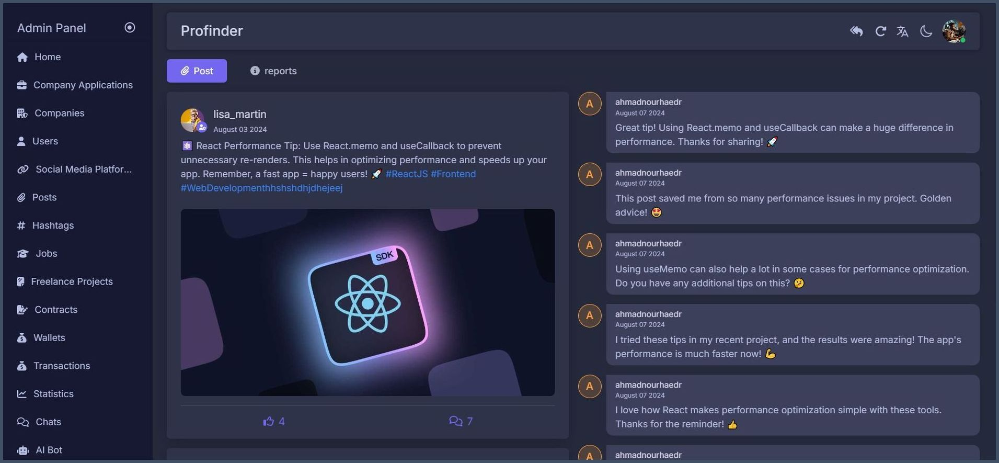
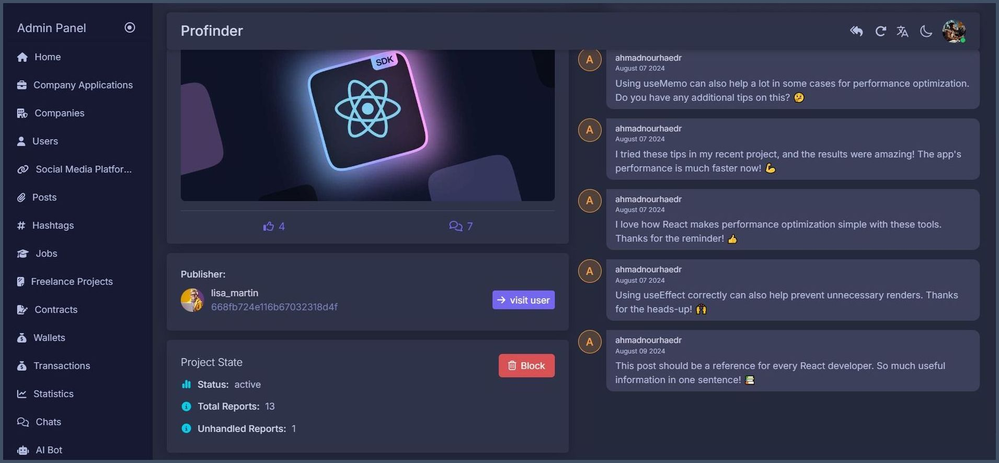
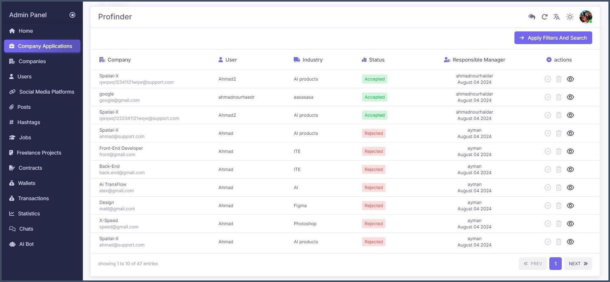
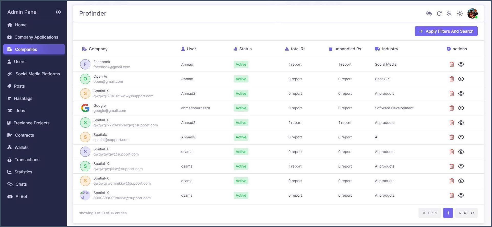
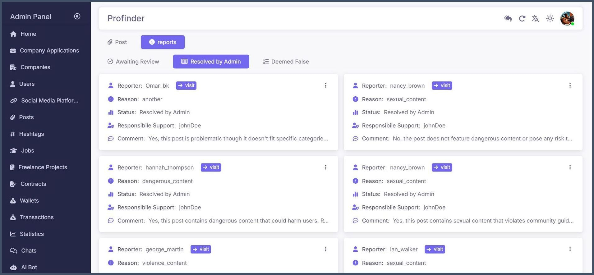
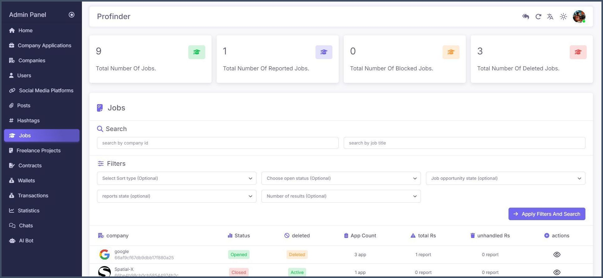
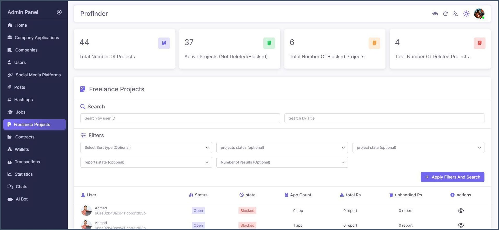

   

    

# **ProFinder** 🔥

## 📜 Table of Contents

- [🛒 Product Links](#-product-links)
- [📦 Flutter Packages](#-flutter-packages)
- [🚀 Intro](#-intro)
- [📚 Main Sections](#-main-sections)
- [✨ Noteworthy Features](#-noteworthy-features)
- [🔍 ProFinder Overview](#-profinder-overview)
- [⚒️ Languages & Frameworks & Tools](#-languages--frameworks--tools)
- [👥 Team Members](#-team-members)
- [📄 License](#-license)
- [🖼️ Project Preview](#-project-preview)

## 🛒 Product Links

[//]: # (- **📱 Android App:** [Download on Google Play]&#40;https://play.google.com/store/apps/details?id=com.example.app&#41;)

- **📱 Android App:** [Download on Telegram](https://t.me/profinder_mobile_app/3)
- **🖥️ Web App:** [Access the Web App](https://profinder-dashboard.web.app/)

## 📦 Flutter Packages

## 🚀 Intro

**ProFinder** is a platform that connects professionals with clients to create valuable work
opportunities. 🤝 Whether you're seeking freelance gigs, looking to hire experts, or aiming to
collaborate with professionals, ProFinder offers a robust system that ensures the rights of both
parties. 💼🔍 The app provides a powerful mechanism for secure transactions 🔒, a comprehensive search
for companies 🏢, and a way to enhance your profile by sharing your CV 📄 to increase job
opportunities. It also features a beautiful and eye-catching design that makes navigation easy and
enjoyable.
🌟 Start using ProFinder today to unlock new possibilities! ✨

## 📚 Main Sections

- 🔑 **Multi-level Login System**   
  *Manage users at various levels including Admin and Super Admin.*

- 🎯 **User Interests and Recommendations**   
  *Manage user interests and receive tailored recommendations.*

- 📝 **Comprehensive Profile Management**   
  *Create and manage a detailed user profile with all necessary information.*

- 👥 **Follow System**   
  *Users can follow other users and be followed, enhancing interaction.*

- 🏢 **Company Creation and Management**   
  *Create, edit, and manage companies and their job postings.*

- 💼 **Job Creation and Applications**   
  *Companies can create job opportunities, and users can apply for these jobs.*

- 🗨️ **Post Creation and Interaction**   
  *Create posts, comment, like, and save posts in the platform.*

- 💵 **Wallet Management**   
  *Manage currency transfers and keep track of transactions.*

- 🛠️ **Freelance Projects**   
  *Create and apply for freelance projects.*

- 📝 **Contract Creation**  
  *Create contracts for freelance projects to ensure mutual agreement and clear terms.*

- 🔔 **Advanced Notification System**   
  *Receive and manage notifications for various activities and updates.*

- 💬 **User-to-User Chat**   
  *Communicate directly with other users to finalize agreements and discuss opportunities.*

- 🚨 **Reporting System**   
  *Report posts, companies, users, job opportunities, or freelance projects.*

- 📞 **Support Center Communication**   
  *Contact the support center for assistance with any issues.*

- 🛡️ **Protection**
  *Several levels of protection have been applied to ensure a secure user experience, safeguarding
  both data and financial transactions.*

## ✨ Noteworthy Features

- 🔍 **Advanced Filtering Operations:**   
  *Empower users with robust filtering capabilities, allowing them to sort any field within a table
  in ascending or descending order, perform searches within specific fields, and retrieve data
  across defined time periods. This feature offers a wide range of filtering options to enhance data
  management and accessibility.*

- 🔔 **Expert Notification System:**   
  *A sophisticated notification system that intelligently responds to user activity. Notifications
  are automatically paused when the user becomes inactive within the application, maintaining a
  streamlined structure and optimizing resource usage for efficient performance.*

- 💬 **Real-Time Conversation:**   
  *Enhance communication by indicating the user’s status—whether online or offline. This feature
  includes comprehensive message status indicators, such as sent, delivered, and read. The
  conversation system is designed to scale, providing reliable and fluid communication across the
  platform.*

- 🖨️ **Profile & Contract Printing:**   
  *Users can print their profile as a CV for job applications both within and outside the platform.
  Additionally, the ability to print contracts between customers and employers is provided, ensuring
  that both parties’ rights are clearly documented and protected.*

- 💰 **Secure Money Transfer:**   
  *The application features a secure wallet that safeguards user transactions. When a freelance job
  request is made, the payment is initially held in the application’s wallet. Upon task completion
  and subsequent admin approval, the funds are securely transferred to the intended recipient,
  ensuring a trustworthy transaction process.*

- 🔐 **Google Login Integration:**   
  *Enhance security and convenience with seamless login through Google, offering users an easy and
  reliable authentication method.*

- ⭐ **Freelancer Evaluation:**   
  *Users have the ability to evaluate freelancers based on their work and project execution. This
  feature ensures transparency and helps future clients make informed decisions when choosing a
  freelancer.*

- #️⃣ **Hashtag Integration:**
  *Hashtags have been implemented to improve content discoverability. Users can easily search for
  and find posts by using relevant hashtags, making navigation more efficient.*

- 🎯 **Suggested Posts Based on User Interests:**   
  *The platform intelligently suggests posts to users based on their interests, providing a more
  personalized and engaging experience by showcasing content that aligns with their preferences.*

- 📸 **Image Compression:**   
  *The application includes a feature to compress images while maintaining high quality. This
  ensures that images are optimized for performance without significant loss of visual fidelity.*

- 🌐 **Translation Feature:**   
  *Messages returned from responses and notifications are translated, allowing users to view content
  and updates in their preferred language.*

- **Statistics 📊**
  *The Statistics section empowers administrators with detailed visibility into the application's
  activities, providing crucial data to track high-demand areas and monitor user interactions.*

# 🔍 ProFinder Overview

Our application features a sophisticated **Multi-Level Login System** that categorizes users into
various roles, each with distinct responsibilities and permissions:

### 👤 **Regular User**

Regular users enjoy a variety of functionalities designed to enhance their experience within the
app. These include:

- **Login Options:** Users can log in using their email or through Google for added convenience 🔐.

- **Post Management:** They can create, edit, and delete posts 📢, as well as comment on posts and   
  delete their comments 💬.

- **Project Interaction:** Users have the ability to publish their own projects and apply for
  projects
  created by others 📝.

- **Company Creation:** Users can request to create a company, which becomes active after admin
  approval 🏢. Once approved, they can publish posts and create job listings within their company 🚀.

- **Diverse Activities:** A wide range of other activities are available to users, providing a
  rich  
  and interactive experience within the application.

### 🛠️ **Admin**

Admins possess broader permissions and are responsible for managing various aspects of the platform:

- **User Management:** Admins can search, filter, delete, and ban users based on their behavior 🔧.
- **Monitoring & Moderation:** They oversee user reports and all user-related activities, ensuring
  compliance with platform standards 🛡️.

- **Admin Levels :**

    1. **💳 Wallet Manager**

    - **Responsibilities:** Oversees all financial
      transactions within the platform. This includes managing wallet operations, handling
      deposits and withdrawals, and ensuring financial transactions are processed securely and
      accurately 🔒.

    2. **🏢 Company Manager**

    - **Responsibilities:** Manages all aspects related to
      company operations. This includes overseeing the creation and management of company
      accounts, ensuring compliance with company guidelines, and handling any issues related to
      company activities 🔍.

    3. **👨‍💼 Freelancer Manager**

    - **Responsibilities:** Focuses on managing freelance
      projects and interactions. Oversees freelancer profiles, project applications, and ensures
      that freelance engagements are conducted smoothly. Also addresses any issues related to
      freelancer performance and project execution 📊.

    4. **🛠️ Technical Support**

    - **Responsibilities:** Provides support for technical
      issues and user inquiries. Handles troubleshooting, resolves technical problems, and
      ensures that the platform’s technical operations run efficiently and effectively 💬.
      Additionally, responds to messages from users experiencing problems, offering assistance
      and guidance through chat interactions.

### **👑 Super Admin**

Super Admins hold the highest level of authority within the application, managing the admins and
overall system functionalities:

- **Admin Management:** Super Admins can create, delete, ban, or modify admin permissions 👩‍💼.
- **Ultimate Control:** With complete oversight, Super Admins have the power to manage every aspect
  of the application, ensuring that it runs smoothly and efficiently ⚙️.

---

User interests are crucial as they allow users to specify their preferences 💡. This helps in
discovering content that aligns with their interests 🔍, displaying posts 📄 and job opportunities 💼
that are suitable and relevant to them.
Users can add, edit, and delete multiple interests on their profiles. This customization ensures
they receive personalized content, including suggested posts and job opportunities that match their
interests. Additionally, users can publish jobs or suggest positions that align with their skills or
preferences, enhancing the relevance of job matches and content suggestions.

---

Our platform offers a robust profile management system 🌟, allowing users to present their
professional and personal information in a detailed and organized manner.

- **🏠 Address:**   
  *Provides detailed information about the user's geographical location.*

- **🏅 Certifications:**   
  *Showcase various certificates that validate skills and achievements.*

- **🎓 Education:**   
  *Lists the stages of education completed, including details of institutions and dates.*

- **📁 Projects:**   
  *Highlights personal projects undertaken, demonstrating experience and expertise.*

- **🛠️ Skills:**   
  *Details the skills possessed, categorized by type or relevance.*

- **🌐 Languages:**   
  *Displays the languages the user is proficient in.*

- **🔗 Social Media Links:**   
  *Provides links to social media profiles for networking and professional connections.*

- **💼 Work Experience:**   
  *Describes experience gained from working in various companies or professional environments.*

- **📎 CV Upload:**   
  *Allows users to upload their CV directly to their profile.*

- **🆔 Personal Information:**   
  *Includes the user's full name, date of birth, bio, phone, and gender.*

---

*The Follow System empowers users to build meaningful connections by following others. 🔍 This
feature allows users to stay updated with the latest posts, activities, and interactions from those
they follow 📈. By fostering a more interactive and engaged community 🌐, it helps users remain
connected with the latest happenings in their network 🔔.*

*Users can follow anyone on the platform and view both their own followers and the users they
follow. 🕵️‍♂️ This feature enhances connectivity by providing easy access to profiles and updates
from followed users 👤. Additionally, users receive timely notifications 🔔 when someone they follow
shares new content or job postings, keeping them informed about relevant activities.* ✨

---

*Users can request to establish a company by submitting necessary documentation, such as a
commercial record or other proof of legitimacy. 📑 The admin will review and verify the submitted
information to ensure the company's authenticity. ✅ Based on this evaluation, the request may be
approved or rejected.*

*Once a company is approved, the company owner can appoint supervisors to assist with managing the
company. 👥 Supervisors have limited control, including tasks such as publishing posts 📝 and job
opportunities, and managing job applications. Posts can be created, modified, or deleted by both the
company owner and supervisors.*

*Anyone within the system can submit a request to create a company, providing all necessary details
and documentation. Once the company is established, the owner can add users as admins, who can then
publish and manage company-related jobs and posts, all while ensuring that the overall management
remains under the owner's authority. 👑*

---

*In the application, a manager can easily create a job listing 🛠 by submitting relevant details
through the manager interface. Once the job is live, users can explore 🔍 available opportunities,
search for specific roles, view company details, and save jobs of interest 💼. When a user finds a
job they want to apply for, they can submit their application by sharing their profile 📄. Managers
can then review all applications for the job, marking them as checked once reviewed ✅. Users also
have full control over their job search, with options to save, unsave, or cancel their applications,
ensuring a smooth and flexible job-hunting experience 🚀.*

---

*Users can create posts 📄 on the platform, which can include multiple images 🖼️ and text ✍️. These
posts can be interacted with by others through comments 💬, likes ❤️, and saves 💾, allowing for
dynamic engagement within the application. Users can also save posts for quick access later 📌.*

*Any user within the platform can publish, edit, or delete their posts. Posts can be composed of
text or text with images, and users can create regular posts or company-specific posts. Company
posts feature the company’s name and image instead of the user’s name and can be published by the
company owner or any admin within the company. 💼*

*All users can comment on posts 💬, like or unlike them ❤️, and save them for future reference 📌.
This flexibility enhances the user experience by making it easier to interact with and manage posts,
whether they are personal or company-related.* 🛠️

---

The application provides robust wallet management features that cater to both administrators and
users, ensuring seamless financial transactions within the platform.

**User Features:**

- 💰 *Transaction History*: Users can view detailed histories of their transactions, keeping track of
  all payments and receipts.
- 🛠️ *Payment Handling*: Users can easily manage payments within the platform, including making and
  receiving payments.
- 📊 *Statistics Monitoring*: Users have access to various statistics related to their financial
  activities, helping them stay informed about their wallet's status.

**Administrator Tools:**

- 🛡️ *Advanced Controls*: Administrators can oversee and manage all wallets on the platform,
  ensuring everything runs smoothly.
- 🚫 *Suspend/Unsuspend Funds*: Admins can suspend or unsuspend funds as necessary, maintaining the
  platform's integrity.
- 💳 *Deposit/Withdraw Funds*: Admins have the ability to deposit or withdraw funds from any wallet,
  ensuring proper financial management.
- 🔍 *Transaction Monitoring*: Administrators can monitor and validate all cash transactions,
  ensuring they comply with the platform's standards and regulations.

---

Our application provides a comprehensive suite of features for managing freelance projects, catering
to various roles such as **users**, **explorers**, and **administrators**.

**User Features:**

- 🔍 *Browse and Apply*: Users can easily browse available freelance projects and apply to those that
  align with their skills.
- 📈 *Track Progress*: Users can monitor the status of their ongoing projects, ensuring they stay on
  track.
- 🛠️ *Manage Projects*: Users have full control over their projects, with the ability to create,
  update, review, and delete them as needed, allowing for a dynamic and flexible project lifecycle.

**Explore Module:**

- 🔍 *Search and Discover*: Users can search for projects based on their interests and expertise.
- ⭐ *Save Favorites*: Favorite projects can be saved for easy access later.
- 👁️ *View Applications*: Users can view their applications, keeping track of where they’ve applied.
- 🚨 *Report Issues*: If there’s a problem with a project, users can report it directly within the
  system.
- ❌ *Unsave Projects*: If a project is no longer of interest, users can unsave it to keep their list
  organized.

**Administrator Tools:**

- 🛡️ *Project Oversight*: Administrators have powerful tools to oversee all freelance projects,
  ensuring the platform remains a fair and efficient space for all users.
- 🔢 *Count Projects*: Track the number of ongoing and completed projects on the platform.
- 🚫 *Block/Unblock Projects*: Administrators can block or unblock projects as necessary to maintain
  quality and compliance.
- 📊 *Detailed Reports*: Admins can view detailed reports of projects, allowing for in-depth analysis
  and management.

---

The application offers a robust and user-friendly system for managing freelance contracts, ensuring
smooth and secure interactions among **users**, **explorers**, and **administrators**.

- **Contract Creation and Management:**
    - ✍️ *Users* can effortlessly create, update, and manage their contracts within the platform.
    - 📄 *Multiple PDF Files*: The system supports the upload of multiple PDF files, making it easy
      to include all necessary documentation.

- **Contract Status:**
    - ✅ *Mark as Successful*: Once a project is completed to satisfaction, users can mark contracts
      as successful.
    - 🚨 *File Complaints*: If issues arise, users can file complaints, which will be reviewed by
      administrators.

- **Administrative Oversight:**
    - 👮 *Administrators* have comprehensive oversight capabilities, allowing them to:
        - 🔍 *Resolve Disputes*: Admins can intervene to resolve disputes between parties.
        - ⬇️ *Download Files*: Access and download any attached files for review.
        - 📊 *Monitor Activities*: Keep an eye on contract activities across the platform to ensure
          compliance and transparency.

- **Explore Module:**
    - 🌍 The explore module provides additional functionalities for users to interact with ongoing
      contracts:
        - ✔️ *Accept or Refuse*: Users can choose to accept or refuse contracts.
        - 🚚 *Shipping*: Users can manage the shipping of contracts as needed.
        - 📂 *Access and Download*: All contract files can be accessed and downloaded easily.

---

*The Advanced Notification System is designed to enhance user engagement through intelligent
notification management 📲. Key features include:*

- **Activity-Based Notification Management:** 🕵️‍♂️ Monitors user activity and adjusts notification
  delivery accordingly. Notifications are paused if a user remains inactive for up to 14 days 🗓️ and
  will automatically resume upon reactivation 🔄.

- **Multilingual Support:** 🌐 Provides notifications in various languages, including Arabic and
  English, ensuring accessibility for a diverse user base 🌍.

- **Reliable Delivery:** 🚀 Utilizes Firebase Admin for sending notifications, leveraging its robust
  infrastructure to ensure timely and dependable communication ⏰.

---

*The User-to-User Chat feature on ProFinder is designed for seamless real-time communication between
users within the application 💬. Key features include:*

- **Real-Time Messaging:** ⚡ Utilizes Socket.io for instant communication, allowing users to chat
  with others in real-time ⏱️.

- **Connection Status:** 🌐 Tracks and displays the connection status of users, indicating whether
  they are online 🟢 or offline 🔴.

- **Message Status:** 📩 Provides clear indicators for message status:
    - **Sent:** 📤 Message has been sent from the sender.
    - **Delivered:** 📥 Message has been received by the recipient.
    - **Read:** 👁️ Message has been read by the recipient.

- **Redis Integration:** 🗃️ Employs Redis to enhance storage and data retrieval operations, ensuring
  quick and efficient message handling with minimal latency 🚀.

*The Reporting System on ProFinder empowers users to report various issues within the platform 🚨.
Key features include:*

- **User Reporting:** 🧑‍🤝‍🧑 Allows users to report other users for reasons such as inappropriate
  posts 🚫, interactions, fraud 💳, or impersonation 👤.

- **Content Reporting:** 📄 Users can also report posts, job opportunities, companies, and other
  content if they encounter issues or violations ⚠️.

- **Admin Review:** 👨‍💼 Reports are reviewed by the admin team, who filter and assess each report to
  determine its validity 🔍.

- **Issue Verification:** ✔️ Admins verify reported issues to confirm their legitimacy and take
  appropriate action based on the findings 🔒.

- **Action and Resolution:** ⚖️ Appropriate actions are taken to address verified problems, ensuring
  a safe and compliant environment for all users 🛡️.

---

*In the event of problems or urgent issues that need resolution 🚨, any user can contact the support
center for assistance with matters related to the application 🛠️. This includes issues with
transactions 💸, projects 📈, or difficulties in publishing 📝 or blocking posts 🚫. The support center
is dedicated to reviewing and addressing any concerns to ensure a fair, clean, and user-friendly
experience 🤝.*

---

Several levels of protection have been applied to ensure a secure user experience, safeguarding both
data and financial transactions. These protections include:

- **Rate Limiting:** ⏱️ Controls the number of requests each user can make within a specific
  timeframe, preventing abuse and brute-force attacks.

- **Helmet Integration:** 🛡️ Enhances security by setting appropriate HTTP headers to protect
  against well-known web vulnerabilities.

- **Bouncer:** 🚫 Locks out attackers by detecting and mitigating brute-force attempts, ensuring user
  accounts remain secure.

- **HPP (HTTP Parameter Pollution) Prevention:** 🚷 Sanitizes and validates query parameters to
  protect against parameter pollution attacks.

- **MongoDB Sanitization:** 🔒 Ensures all data sent to the database is sanitized, protecting against
  injection attacks.

- **Content Security Policy (CSP):** 🛡️ Restricts content sources to trusted origins, adding an
  additional layer of security against cross-site scripting and data injection.

These robust security measures are designed to protect users’ data and money, providing a safe and
reliable platform experience.

## **⚒️ Languages & Frameworks & Tools**

 

 

 

 

 

## 👥 Team Members

| S.No. | Name                                                      | Role               | Technology | LinkedIn                                                             | Email                     |
|-------|-----------------------------------------------------------|--------------------|------------|----------------------------------------------------------------------|---------------------------|
| 1.    | [Omar Bkdash](https://github.com/Omar-Bkdash-7)           | Mobile Developer   | Flutter    | [@Omar-Bkdash](https://www.linkedin.com/in/omar-bkdashh)             | omarbkdash7@gmail.com     |
| 2.    | [Ahmed Nour Haidar](https://github.com/Ahmad-Nour-Haidar) | Mobile Developer   | Flutter    | [@Ahmed-Nour-Haider](https://www.linkedin.com/in/ahmad-nour-haidar/) | ahmadnourhaidar@gmail.com |
| 3.    | [Osama Saddik](https://github.com/osamasaddik)            | Frontend Developer | React.js   | [@Osama-Saddik](https://www.linkedin.com/in/osama-saddik-8b814b259)  | saddikosama@gmail.com     |
| 4.    | [Ayman Al-khatib](https://github.com/Ayman-Al-Khatib)     | Backend Developer  | Express.js | [@Ayman-Al-Khatib](https://www.linkedin.com/in/ayman-al-khatib)      | ayman.eng.job@gmail.com   |
| 5.    | [Ahmad Ajajeh](https://github.com/Ahmad-Ajajeh)           | Backend Developer  | Express.js | [@Ahmad-Ajajeh](https://www.linkedin.com/in/ahmed-ajajeh-b999b6175/) | ajajeh356@gmail.com       |
| 6.    | [Alaa Haidar](https://www.instagram.com/_alaa.haidar)     | UI & UX            | Figma      | [@Alaa-Haidar](https://www.linkedin.com/in/alaa-haidar/)             | alaahaidaar@gmail.com     |

## 📄 License

This project is licensed under the MIT License. See the [LICENSE](LICENSE) file for details.

## 🖼️ Project Preview

The mobile application offers a user-friendly interface and intuitive design to enhance the user
experience. Below are the mockups showcasing various features and screens of the application.

  

    
    
    
  

  

    
    
    
  

  

    
    
    
  

  

    
    
    
  

  

    
    
    
  

  

    
    
    
  

  

    
    
    
  

  

    
    
    
  

  

    
    
    
  

---

The **Admin Dashboard** provides a web interface to manage user activities and edit content. Below
are screenshots showing its light and dark modes for admins.

    
    
    
    
    
    
    
    
    
    
    
    
    
    
    
    
    
    
    
    
    
    
    
    
    
    
    
    
    
    
    
    
    
    
    
    
    
    
    
    
    
    
    
    
    
    
    
    
    
    
    
    
    
    
    
    
    
    
    
    
    
    
    
    
    
    
    
    

---

Below are new screenshots from the **Super Admin** Dashboard section. Only unique screens that are
not already featured in the Admin Dashboard are included.

     
     
     
     
     
     

